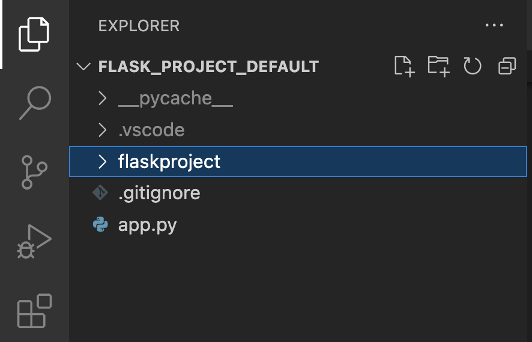
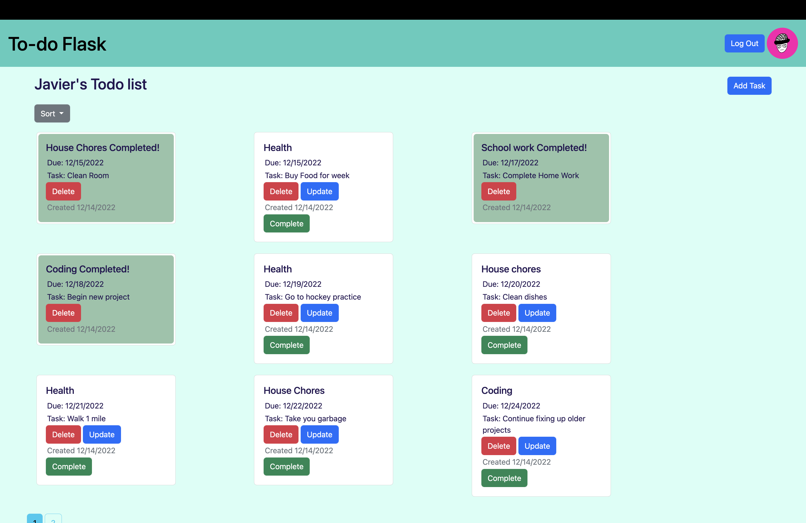

## Use

* Flask
* Flask-SQLAlchemy

## Install

```
In Terminal:
pip (or pip3) install -r requirements.txt (this depends on how your system is set up)
```
## Make sure the project files arragned as such


## Create Date Base

Get into the pyhon termial and input the following
```
from flaskproject import db
from flaskproject.models import User, ToDO
db.create_all()
```
## Run

```
In Terminal:
python (or python3) app.py (this depends on how your system is set up)
```

## Screenshot 
Create an account and sign in you can create, update, delete, & complete tasks you set for yourself
